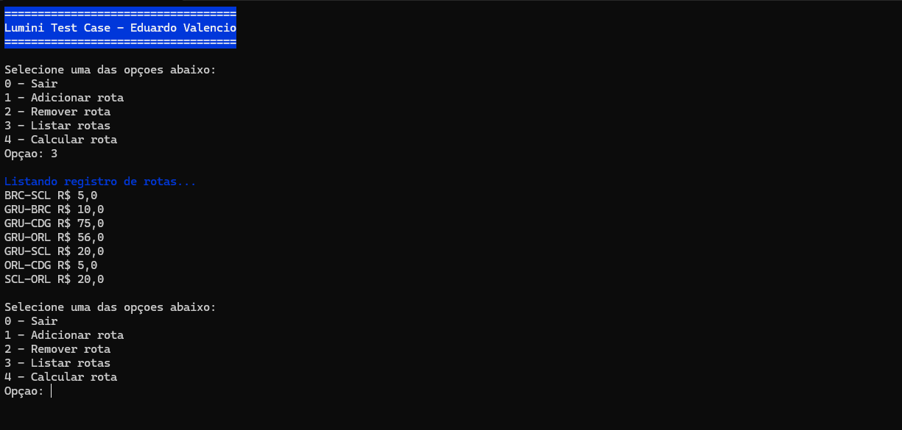
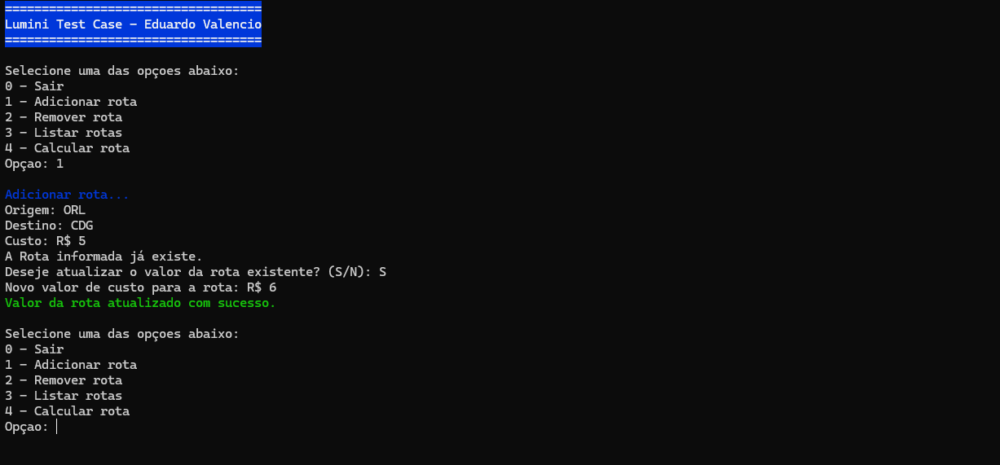
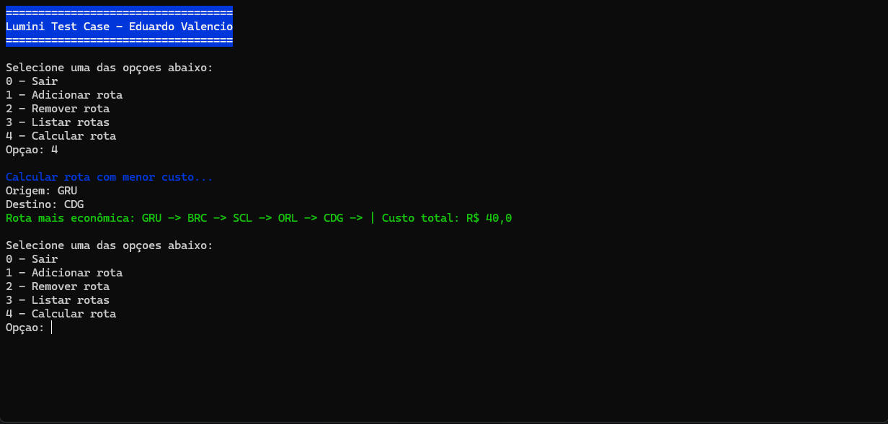

<p align="center">
  
</p>
<p align="center" style="font-weight: bold; font-size: 1.5em">
Rota de Viagem <br/> Teste Técnico
</p>

<p align="center">
  
  
</p>

<p align="center" style="font-size: small">Eduardo Valencio Santos</p>

---

* [Intrdução](#introdução)
* [Requisitos](#requisitos)
* [Arquitetura do Projeto](#arquitetura-do-projeto)
* [Possiveis Melhorias (Não são pré requsito)](#possiveis-melhorias-não-são-pré-requsito)
* [Como Rodar a Aplicação](#como-rodar-a-aplicação)
* [Preview](#preview)
* [EXTRA - Video de Apresentação](#extra---video-de-apresentação)

---

## Introdução
Este projeto implementa um sistema para encontrar a rota de viagem mais barata entre dois pontos, considerando múltiplas conexões. O sistema também permite registrar novas rotas, que são persistidas para consultas futuras. O projeto segue a principal regra de não usar o algoritmo de Dijkstra e apesar de simples a sua arquitetura foi pensada para mostrar o conhecimento em grandes aplicações que se baseiam no DDD (Domain Driven Design).

---

## Requisitos

- .NET SDK 8

## Arquitetura do Projeto
A arquitetura do projeto foi projetada com o objetivo de ser escalável, mesmo sendo uma aplicação pequena. A solução é organizada nas seguintes camadas:
- **ConsoleApp**: Responsável por interagir com o usuário, recebendo os dados de entrada e exibindo os resultados.
- **Application**: Contém a lógica de negócio, incluindo casos de uso e serviços que processam as informações e implementam as regras definidas.
- **Infrastructure**: Gerencia o acesso ao banco de dados, incluindo a configuração de tabelas e persistência dos dados.
- **Domain**: Define as entidades principais que são compartilhadas entre os projetos Application e Infrastructure, promovendo consistência e reutilização.
- **Tests**: Implementa testes unitários simples para validar as regras de negócio. Em projetos mais complexos, seria necessário criar um projeto adicional para testes de integração, incluindo gerenciamento de memória em cache e outros aspectos.
- **Communication**: Contém entidades compartilhadas entre as camadas ConsoleApp e Application, garantindo uma comunicação padronizada.
- **Exceptions**: Define exceções personalizadas para controle de ações na lógica de negócio e no console.

Essa estrutura modular permite que a aplicação seja facilmente mantida e expandida no futuro, separando responsabilidades claramente entre as camadas. Além de estruturas com namespaces de forma a ficar mais organizado e fácil de entender.

##  Possiveis Melhorias (Não são pré requsito)
- Adicionar uma interface gráfica para facilitar o uso do sistema.
- Adicionar arquivo de configuração para banco de dados
- Implementar bibliotecas para realizar a aplicação mais consistente de Inversão de Dependências.
- Otimização do algoritmo para grandes volumes de dados.
- Testes integrados incluindo handle de exceções no console e banco em cache.

---

## Como Rodar a Aplicação

#### Com .NET SDK 8
```
git clone https://github.com/projEduardoValencio/lumini-test-case.git
cd lumini-test-case
dotnet run --project ./src/Lumini.ConsoleApp/Lumini.ConsoleApp.csproj
```

#### Com .NET Runtime 8
```
git clone https://github.com/projEduardoValencio/lumini-test-case.git
cd lumini-test-case
dotnet ./src/Lumini.ConsoleApp/bin/Release/net8.0/Lumini.ConsoleApp.dll 
```

---

## Preview
<div style="display: grid; grid-template-columns: 1fr 1fr; gap: 10px">
    
    
    
</div>

---

## EXTRA - Video de Apresentação
O seguinte video tem cerca de **2 min** e foi gravado após a entrega do projeto para explicar um pouco melhor o projeto. 

<a href="https://www.youtube.com/watch?v=wSv0uusTI0I" target="_blank" style="width: 100%, height: auto">
  
</a>

---
